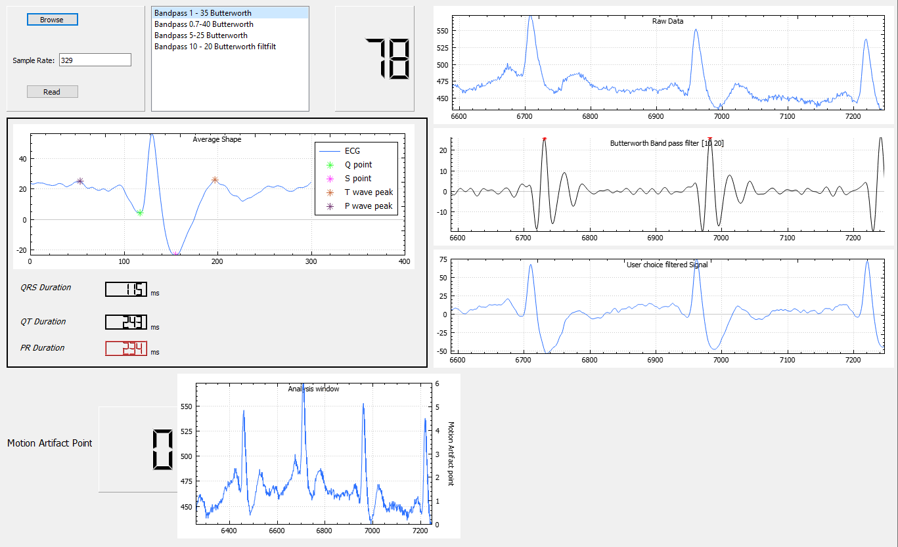

# Iroh

# Project Title

Signal processing on Real-time ECG signals using C++ in QT.

## Getting Started

The project consists of several functions which work independent from each other.

 Functions
  * Reading the data from serial port 
  * Applying digital filters to signal to extract features. 
  * Motion artifact detection from signal
  * Extract features from ECG signal like Q-R-S points

### Prerequisites

To modify and compile the code, Qt has to be installed on computer from [Qt web page](https://www.qt.io/)

For plotting library, qcustomplot is used.  [One of the best data visualization library](https://www.qcustomplot.com/)

## Run the Example from .exe file

Downloand the .exe file, Run the ECG.exe. Follow the images with order 

1-Click the Read from file

2-Click Browse, select the csv file in Examples. Enter the sampling rate as shown.

3- Press Read button and Magic happens 

