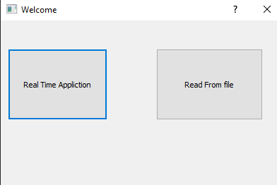
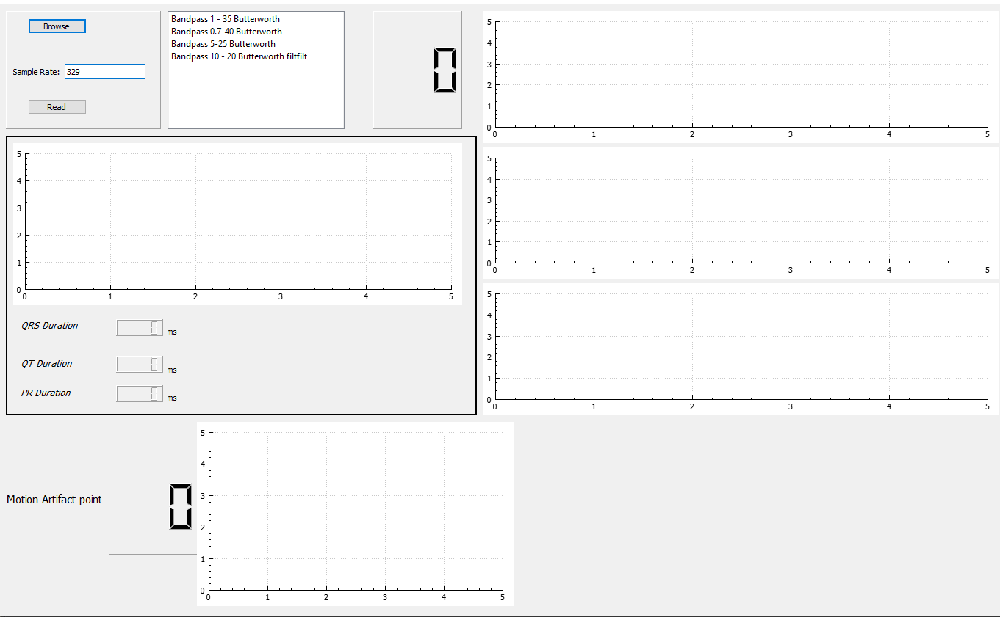
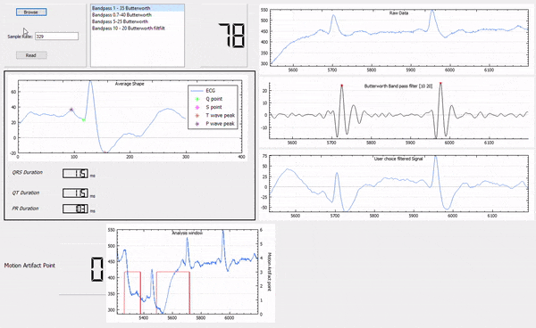

# Real-Time ECG   

# Project Title

Signal processing on Real-time ECG signals using C++ in QT.     

## Getting Started

The project consists of several functions which work independent from each other.

 Functions
  * Reading the data from serial port 
  * Applying digital filters to signal to extract features. 
  * Motion artifact detection from signal
  * Extract features from ECG signal like Q-R-S points

### Prerequisites

To modify and compile the code, Qt has to be installed on computer from [Qt web page](https://www.qt.io/)

For plotting library, qcustomplot is used.  [Data visualization library which can be accessed from this link](https://www.qcustomplot.com/)

## Run the Example from .exe file

Downloand the .exe file, Run the ECG.exe. Follow the images with order 

1-Click the Read from file

2-Click Browse, select the csv file in Examples. Enter the sampling rate as shown.

3- Press Read button and Magic happens 

This example only demonstrates the feature of reading from file. The program is also working with the Real-time signals.

## Real-time Application

 The program is also processing signal on real-time by serial port. The default communication with serial port is Big Endian, if anyone wants to change the way of communicating, it can be done by just changing the readData function, the rest of the program works same.
 
 When the program runs, it seems like that
 
 
 
 
 Real-time option has also different features from reading file, you can save the three different data type(Raw data; QT, QRS, PT durations) to directory where you want to save.
 

